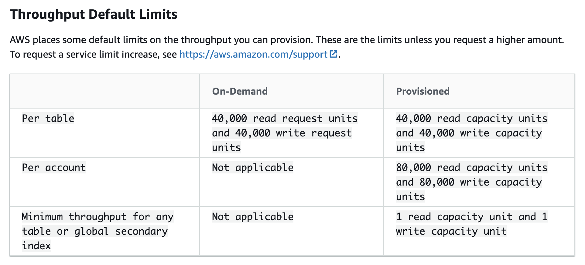
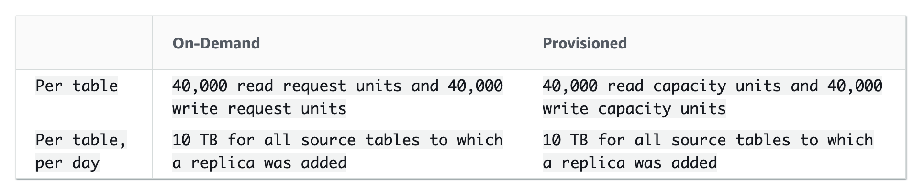

## General Notes
DynamoDB are always backed by Solid State Disks which are spread across 3 AZs

### Modes of Provisioning
Here we discuss the ways in which the Capacity of DynamoDB can be provisioned.

1. Write Capacity Units
2. Read Capacity Units

For example, suppose that you create a provisioned table with 6 read capacity units and 6 write capacity units. With these settings, your application could do the following:
1. Perform strongly consistent reads of up to 24 KB per second (4 KB × 6 read capacity units).
2. Perform eventually consistent reads of up to 48 KB per second (twice as much read throughput).
3. Perform transactional read requests of up to 12 KB per second.
4. Write up to 6 KB per second (1 KB × 6 write capacity units).
5. Perform transactional write requests of up to 3 KB per second.

#### Provisioned Throughput (we can also augment this mode with Autoscaling)
Here we request for a specific number interms of capacity for 
1. Write Capacity Units
2. Read Capacity Units

Increasing and Decreasing:
1. We can increase ReadCapacityUnits or WriteCapacityUnits as often as necessary, using the AWS Management Console or the UpdateTable operation.
2. For every table and global secondary index in an UpdateTable operation, you can decrease ReadCapacityUnits or WriteCapacityUnits (or both).

#### OnDemand
1. Pay for what you use and you don't need to specify how much read and write throughput you expect your application to perform.
2. Great for unpredictable workloads, spiky, short lived, pay-per-use model
3. On-demand capacity mode instantly accommodates up to double the previous peak traffic on a table. However, throttling can occur if you exceed double your previous peak within 30 minutes. 

#### AutoScaling
1. With auto scaling, you define a range (upper and lower limits) for read and write capacity units. You also define a target utilization percentage within that range. 
2. With DynamoDB auto scaling, a table or a global secondary index can increase its provisioned read and write capacity to handle sudden increases in traffic, without request throttling.

#### Reserved
1. With reserved capacity, you pay a one-time upfront fee and commit to a minimum usage level over a period of time. 
2. By reserving your read and write capacity units ahead of time, you realize significant cost savings compared to on-demand provisioned throughput settings.

#### Notes 
1. You can set the read/write capacity mode when creating a table or you can change it later.
2. We can switch Tables between Provisioned and Autoscaling models once in a 24-hour period.

#### ProvisionedThroughPutExceededException
1. SDK will automatically retry the request until it is successful when this exception is encountered.
2. If you are not using the SDK then Reduce the Request Frequency or use Exponential Backoff
3. In addition to simple retries all AWS SDKs use Exponential back-offs

#### Throughput Default Limits

### Limits and Limitations
1. There is no practical limit on a table's size. Tables are unconstrained in terms of the number of items or the number of bytes.
2. For any AWS account, there is an initial limit of 256 tables per AWS Region. - Can be increased via Service Limit Increase request.
3. The maximum item size in DynamoDB is 400 KB, which includes both attribute name binary length (UTF-8 length) and attribute value lengths (again binary length). The attribute name counts towards the size limit.
4. DynamoDB supports nested attributes up to 32 levels deep.
5. A transaction cannot contain more than 25 unique items.
6. A transaction cannot contain more than 4 MB of data.
7. A transaction cannot operate on tables in more than one AWS account or Region.
8. The minimum length of a partition key value is 1 byte. The maximum length is 2048 bytes.
9. There is no practical limit on the number of distinct partition key values, for tables or for secondary indexes.
10. The minimum length of a sort key value is 1 byte. The maximum length is 1024 bytes.
11. In general, there is no practical limit on the number of distinct sort key values per partition key value.
12. You can project a total of up to 100 attributes into all of a table's local and global secondary indexes. 
13. You can define a maximum of 5 local secondary indexes.
14. There is an initial limit of 20 global secondary indexes per table. To request a service limit increase
15. Do not allow more than 2 processes to read from the same DynamoDB Streams shard at the same time.
16. AWS places some default limits on the write capacity for DynamoDB tables with DynamoDB Streams enabled. 
17. A DAX cluster consists of exactly one primary node, and between 0 and 9 read replica nodes.
18. In a DAX cluster - The total number of nodes (per AWS account) cannot exceed 50 in a single AWS Region.
19. BatchGetItem - A single BatchGetItem operation can retrieve a maximum of 100 items. The total size of all the items retrieved cannot exceed 16 MB.
20. BatchWriteItem - A single BatchWriteItem operation can contain up to 25 PutItem or DeleteItem requests. The total size of all the items written cannot exceed 16 MB.
21. Query - The result set from a Query is limited to 1 MB per call.
22. Scan - The result set from a Scan is limited to 1 MB per call.
23. CreateTable/UpdateTable/DeleteTable - In general, you can have up to 50 CreateTable, UpdateTable, and DeleteTable requests running simultaneously (in any combination). In other words, the total number of tables in the CREATING, UPDATING, or DELETING state cannot exceed 50.

### Global Tables
#### Transaction Guarantees

Transactional operations provide atomicity, consistency, isolation, and durability (ACID) guarantees only within the AWS Region where the write is made originally. Transactions are not supported across Regions in global tables. For example, suppose that you have a global table with replicas in the US East (Ohio) and US West (Oregon) Regions and you perform a TransactWriteItems operation in the US East (N. Virginia) Region. In this case, you might observe partially completed transactions in the US West (Oregon) Region as changes are replicated. Changes are replicated to other Regions only after they have been committed in the source Region.

### Expressions
1. ProjectionExpression
2. ConditionExpression
3. UpdateExpression
4. FilterExpression

### Access Control
Fine Grained access control via IAM
Can define a policy to say - Only allow access to Items with Primary Key = X and allow changes to only Y attributes

### DAX
1. DynamoDB Accelerator - Fully managed, clustered in-memory caching for DynamoDB
2. Can provide upto 10x Read Performance Improvement
3. Only supports **Write-Through** caching
4. Optimised for use with DynamoDB only
5. When enabled you point your DynamoDB API calls to the DAX Cluster instead of your Table.
6. For Cache Miss it reads data using **Eventual Consistency Reads**.
7. If a usecase needs **Strongly Consistent Reads** then DAX is not an Option
8. Reduces the Read load on the DynamoDB
9. Not suitable for Write heavy workloads

### DynamoDB Transactions
1. ACID Transactions with DynamoDB
2. Read or Write Items across multiple Tables as an All or Nothing Operation.
3. Take note of RW Capacity units when using Transactions.

### DynamoDB TTL
1. Allows you to set a Expiry on Data.
2. Once data expires it is marked for deletion and actual deletion happens within the next 48 hours.
3. Helps reduce cost by removing unwanted data ex: Session Table

### DynamoDB Streams
1. Time-ordered sequence of item level modifications in your DynamoDB table i.e insert/update/delete stored as encrypted logs for 24 hours
2. Streams are accessed using a dedicated endpoint just like the DAX endpoint
3. Before and After state of the entire Item can be recorded in the stream but by default only Primary key is recorded.
4. Can be a event source for Lambda - Lambda Polls the DynaomDB stream.

### RCU and WCU Calculation

For example, suppose that you create a provisioned table with 6 read capacity units and 6 write capacity units. With these settings, your application could do the following:
1. Perform strongly consistent reads of up to 24 KB per second (4 KB × 6 read capacity units).
2. Perform eventually consistent reads of up to 48 KB per second (twice as much read throughput).
3. Perform transactional read requests of up to 12 KB per second.
4. Write up to 6 KB per second (1 KB × 6 write capacity units).
5. Perform transactional write requests of up to 3 KB per second.

Provisioned throughput is the maximum amount of capacity that an application can consume from a table or index. If your application exceeds your provisioned throughput capacity on a table or index, it is subject to request throttling.

Throttling prevents your application from consuming too many capacity units. When a request is throttled, it fails with an HTTP 400 code (Bad Request) and a ProvisionedThroughputExceededException. The AWS SDKs have built-in support for retrying throttled requests, so you do not need to write this logic yourself.

#### RCU
For example, if your item size is 8 KB, you require 2 read request units to sustain one strongly consistent read, 1 read request unit if you choose eventually consistent reads, or 4 read request units for a transactional read request.

#### WCU
For example, if your item size is 2 KB, you require 2 write request units to sustain one write request or 4 write request units for a transactional write request.

### Switching between RW Capacity Modes

For a given Table the change can only be done once in a 24 hour period.

When you switch a table from provisioned capacity mode to on-demand capacity mode, DynamoDB makes several changes to the structure of your table and partitions. This process can take several minutes. During the switching period, your table delivers throughput that is consistent with the previously provisioned write capacity unit and read capacity unit amounts. 

When switching from on-demand capacity mode back to provisioned capacity mode, **your table delivers throughput consistent with the previous peak reached when the table was set to on-demand capacity mode.**
