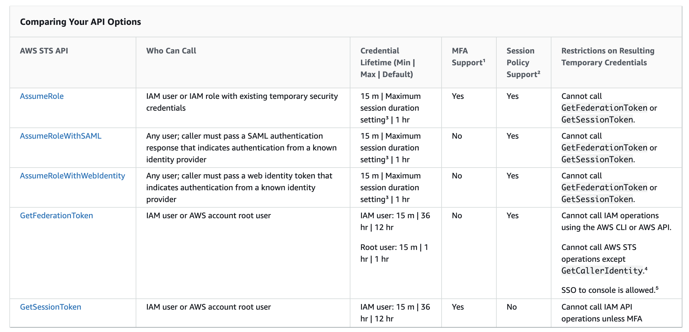

## General Notes:

1. AWS Security Token Service (AWS STS) is used to create and provide trusted users with temporary security credentials that can control access to your AWS resources.
2. You can provide access to your AWS resources to users **without having to define an AWS identity for them.**
3. Temporary credentials are the **basis for roles and identity federation.**

### Requesting Temporary Security Credentials

1. AssumeRole—Cross-Account Delegation and Federation Through a Custom Identity Broker
2. AssumeRoleWithWebIdentity—Federation Through a Web-Based Identity Provider
3. AssumeRoleWithSAML—Federation Through an Enterprise Identity Provider Compatible with SAML 2.0
4. GetFederationToken—Federation Through a Custom Identity Broker
5. GetSessionToken—Temporary Credentials for Users in Untrusted Environments

### Revoking Temporary Security Creds associated with a IAM Role
IAM --> Select IAM Role --> Revoke Active Sessions --> IAM now attaches AWSRevokeOlderSessions policy for the IAM Role in question (The policy denies all access to users who assumed the role before the moment you chose Revoke active sessions.).

### Denying Access to Credentials created by:
1. AssumeRole
2. AssumeRoleWithSAML
3. AssumeRoleWithWebIdentity
4. GetFederationToken
5. GetSessionToken

To change or remove the permissions assigned to the temporary security credentials obtained by calling the API operations above - 
1. you edit or delete the policies that are attached to the IAM user whose credentials were used to call..
2. you edit or delete the role permission policy that defines the permissions for the assumed role

The temporary security credentials obtained by calling the API operations above can never have more permissions than those defined in the permissions policy of the assumed role or the IAM user that was used to generate the credentials and the permissions assigned to temporary security credentials are evaluated each time they are used to make an AWS request. It is important to note that when you edit or delete the permissions of an IAM user/Role, the changes affect the IAM user/Role as well as all temporary security credentials created by that user/Role.
