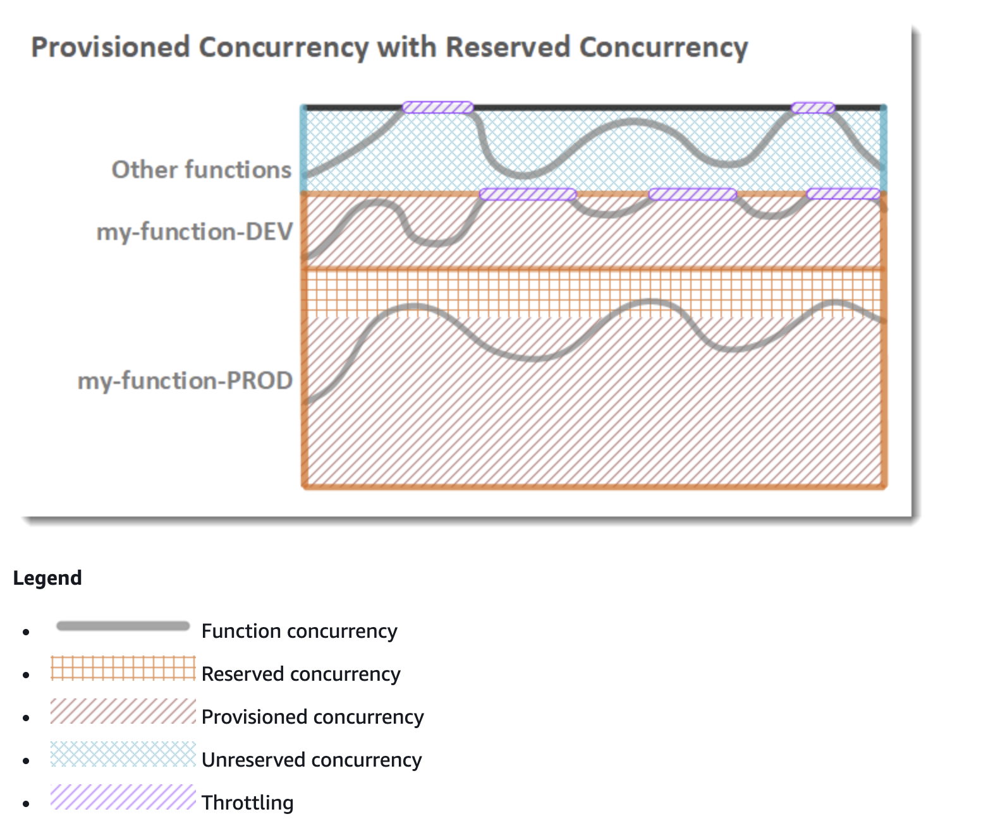

## General Notes

### Concurrency
1. Concurrency is subject to a Regional limit that is shared by all functions in a Region. 
2. Reserved Concurrency
2a. When a function has Reserved Concurrency, no other function can use that concurrency. 
2b. Reserved concurrency also limits the maximum concurrency for the function, and applies to the function as a whole, including versions and aliases.
3. To enable your function to scale without fluctuations in latency, use Provisioned Concurrency. 
4. Provisioned concurrency counts towards a function's reserved concurrency and Regional limits.

