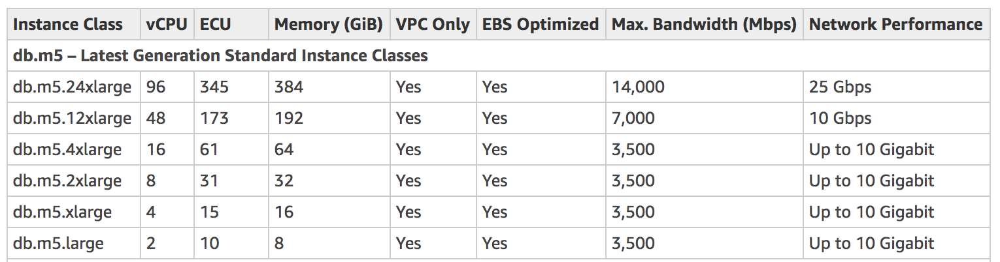
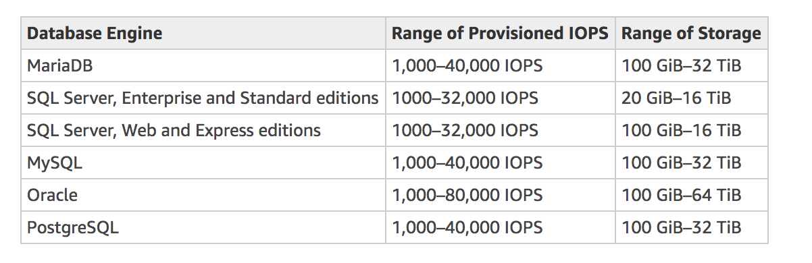
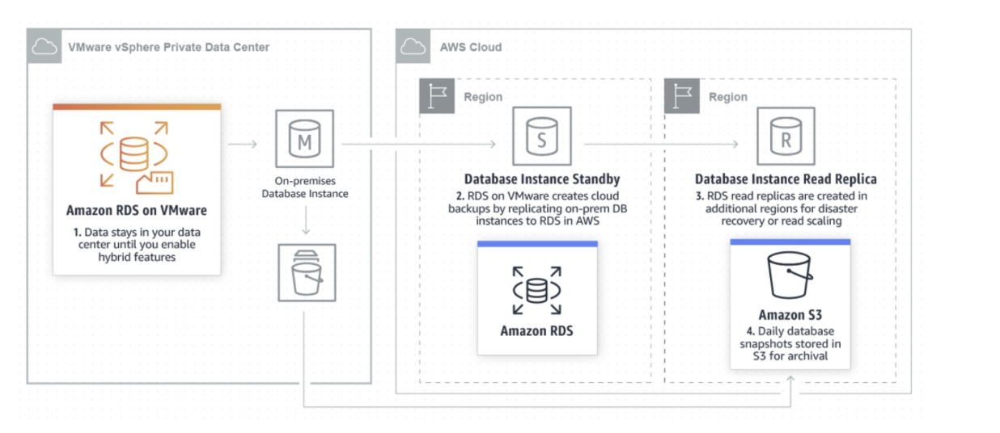

# General Notes

PaaS - PostgreSQL, MySQL (InnoDB is the default storage engine), Oracle, MS SQL, MariaDB (XtraDB is the default storage engine), Amazon Aurora
1. Automatic Backup
2. Automatic Patching
3. Automatic Upgrades
4. RDS can only scale Manually ie not AutoScaling
5. Resources aren't replicated across AWS Regions unless you do so specifically.
6. To create or work with an Amazon RDS DB instance in a specific AWS Region, use the corresponding regional service endpoint. **ex:rds.us-east-1.amazonaws.com**	
7. AWS Identity and Access Management (IAM) database authentication can be enabled for DB instance.
8. Enhanced Monitoring is being enable
For production OLTP use cases, we recommend that you use Multi-AZ deployments for enhanced fault tolerance with Provisioned IOPS storage for fast and predictable performance.
9. Periodically, Amazon RDS performs maintenance on Amazon RDS resources. Maintenance most often involves updates to the DB instance's underlying hardware, underlying operating system (OS), or database engine version. 
10. Amazon RDS uses the MariaDB, MySQL, Oracle, and PostgreSQL DB engines' built-in replication functionality to create a special type of DB instance called a Read Replica from a source DB instance. MS SQLServer uses SQLServer Mirroring.
11. Arn Format
```
arn:aws:rds:<region>:<account number>:<resourcetype>:<name>
```

You cannot access the underlying OS of an RDS system via SSH as it is fully managed by AWS.

DB Paramater Groups:
	DB Configuration properties defined while creating RDS clusters

DB Options Groups:	
	DB extensions and additional features can be defined while creating RDS clusters

Multi-AZ does not improve performance - It is only for fault tolerance and HA. For performance create Read Replicas and use Caching technologies like Elasticache.

## Replication
Read replicas not supported for Oracle and MS SQLServer.

RDS in MultiAZ set-up creates Synchronous Replication between Primary/Master and Standby DB to minimize the RPO and RTO.

1. Replication between Primary and StandBy - Synchronous
2. Replication between Primary and Read Replica - Asynchronous

Master DB and Read Replicas will have different End Points and AWS does not support front ending the DB end points with ELB so a possible option is to use HAProxy.

You can even have Read Replicas of Read Replicas.

You must have Automatic Backups to have a Read Replica.

Each Read Replica has its own DNS end point and Read Replicas can be promoted as their Own DB's which breaks replication.

### Creating Read Replica
1. When you create a Read Replica, you first specify an existing DB instance as the source. 
2. Then Amazon RDS takes a snapshot of the source instance and creates a read-only instance from the snapshot. 
3. The Read Replica operates as a DB instance that allows only read-only connections.
4. Amazon RDS replicates all databases in the source DB instance.
5. In some cases, a Read Replica resides in a different AWS Region than its source DB instance. In these cases, Amazon RDS sets up a secure communications channel between the source DB instance and the Read Replica. Amazon RDS establishes any AWS security configurations needed to enable the secure channel, such as adding security group entries.
6. You can also promote a read replica to become a Primary DB. When you promote a Read Replica, the DB instance is rebooted before it becomes available.7. You can monitor the status of a Read Replica in several ways. The Amazon RDS console shows the status of a Read Replica in the Availability and durability section of the Read Replica details.
8. You can monitor replication lag in Amazon CloudWatch by viewing the Amazon RDS ReplicaLag metric. Replica Lag is essentially Seconds Behind Master


## Failover
The time it takes for the failover to complete depends on the database activity and other conditions at the time the primary DB instance became unavailable. Failover times are typically **60-120 seconds**. However, large transactions or a lengthy recovery process can increase failover time

It typically takes one to 2 minutes for the failover from Primary to Standby DBs

In Multi-AZ, the primary DB instance switches over automatically to the standby replica if any of the following conditions occur:
1. An Availability Zone outage
2. The primary DB instance fails
3. The DB instance's server type is changed - You can change the DB instance class and the RDS does not reboot immediately.
4. The DB instance is undergoing software patching
5. A manual failover of the DB instance was initiated using Reboot with failover

## Backups
On RDS - Automated backups are enabled by default with the **Default retention period of 7 days** and you can change the retention period to upto **35 days**. Amazon RDS creates a storage volume snapshot of your DB instance, backing up the entire DB instance and not just individual databases. 

2 Types of DB backup options:
1. User Initiated - Backups are retained when instance is terminated.
```
Back-up of Data and Transaction logs
Retention period of 1 day (default) to 5 days for Daily back-up
Periodic backup along with Transaction logs can provide recovery upto **LastRestorableTime** which is usually - **last 5 minutes/300 seconds**
```
2. Automated - Backups are removed when instance is terminated.

When we deploy multi-AZ and if the Primary fails then the DB automatically fails over to the Standby and Route53 updates the DB endpoint address so that applications now start pointing to the 2nd instance automatically.

Backup are at Storage level and also Transaction logs so the entire DB Server is backed up and not the individual Database instances.

Backups are to be performed during a backup window to avoid Latency due to IO suspension. In multi-AZ deployment the latency should be less as the backup happens from the Standby instance.

Creating this DB snapshot on a Single-AZ DB instance results in a brief I/O suspension that can last from a few seconds to a few minutes, depending on the size and class of your DB instance. Multi-AZ DB instances are not affected by this I/O suspension since the backup is taken on the standby. 

If you have automated DB snapshots that you want to delete **without deleting the DB instance**, change the backup retention period for the DB instance to 0. The automated snapshots are deleted when the change is applied. You can apply the change immediately if you don't want to wait until the next maintenance period. After the change is complete, you can then re-enable automatic backups by setting the backup retention period to a number greater than 0. 

## Restore
When you restore from a DB snapshot data a new DB instance is created ie you cannot restore into an existing DB instance.
	
When you restore only the default Parameter Groups and Security Groups are attached. You need to attach any custom Property Groups and Security Groups as soon as the DB is restored.

1. We recommend that you retain the parameter group for any DB snapshots you create, so that you can associate your restored DB instance with the correct parameter group. You can specify the parameter group when you restore the DB instance.
2. When you restore a DB instance, the default security group is associated with the restored instance. As soon as the restore is complete and your new DB instance is available, you must associate any custom security groups used by the instance you restored from.
3. When you restore a DB instance, the option group associated with the DB snapshot is associated with the restored DB instance after it is created.

### Point in Time Recovery
You can restore a DB instance to a specific point in time, creating a new DB instance . When you restore a DB instance to a point in time, the default DB security group is applied to the new DB instance. 

RDS uploads transaction logs for DB instances to Amazon **S3 every 5 minutes**. To determine the latest restorable time for a DB instance, use the AWS CLI describe-db-instances command and look at the value returned in the LatestRestorableTime field for the DB instance. In the AWS Management Console, this property is visible as the Latest restore time for the DB instance. You can restore to any point in time during your backup retention period.

Since storage and Transaction logs are backed up we can restore to any point within the retention period typically upto the last **5 minutes/300 seconds**

## Vertical Scaling
Change Instance Type, Change Storage Class

## Horizontal Scaling: 
Both these techniques require additional logic in the Application to...
1. Add Read Replicas - Send Read queries to the read replicas.
2. Partitioning or Sharding - Send Queries to the correct Shards.
	
Notes about Horizontal Scaling:
NoSQL databases like DynamoDB, Cassandra, HBase, MongoDB are designed to scale Horizontally.
There will also be some limitations on the types of queries that can be made across server boundaries.

## Encryption
1. Enable encryption during DB creation.
2. The underlying EC2 instance must support Encryption.
3. When Encryption is enabled - Data, Transaction Logs, Backups are all enrypted at rest.

You can copy a snapshot that has been encrypted using an AWS KMS encryption key. If you copy an encrypted snapshot, the copy of the snapshot must also be encrypted. If you copy an encrypted snapshot within the same AWS Region, you can encrypt the copy with the same KMS encryption key as the original snapshot, or you can specify a different KMS encryption key. If you copy an encrypted snapshot across regions, you can't use the same KMS encryption key for the copy as used for the source snapshot, because KMS keys are region-specific. Instead, you must specify a KMS key valid in the destination AWS Region.

You can also encrypt a copy of an unencrypted snapshot. This way, you can quickly add encryption to a previously unencrypted DB instance. That is, you can create a snapshot of your DB instance when you are ready to encrypt it, and then create a copy of that snapshot and specify a KMS encryption key to encrypt that snapshot copy. You can then restore an encrypted DB instance from the encrypted snapshot. **Same as encrypting an enencrypted EBS snapshot**

## Read Replicas
Amazon RDS uses the MariaDB, MySQL, Oracle, and PostgreSQL DB engines' built-in replication functionality to create a special type of DB instance called a Read Replica from a source DB instance. 

The type of storage for a Read Replica is independent of that on the master DB instance. For example, you might use General Purpose SSD for Read Replicas with a master DB instance that uses Provisioned IOPS SSD storage to reduce costs

## Modifying the DB Instance
Most modifications to a DB instance can be applied immediately or deferred until the next maintenance window. Some modifications, such as parameter group changes, require that you manually reboot your DB instance for the change to take effect.

If you don't choose to apply changes immediately, the changes are put into the pending modifications queue. During the next maintenance window, any pending changes in the queue are applied. If you choose to apply changes immediately, your new changes and any changes in the pending modifications queue are applied.

Changes to some database settings are applied immediately, even if you choose to defer your changes.

## Maintenance Process ex: Upgrades
Running a DB instance as a Multi-AZ deployment can further reduce the impact of a maintenance event, because Amazon RDS applies operating system updates by following these steps:

1. Perform maintenance on the standby.
2. Promote the standby to primary.
3. Perform maintenance on the old primary, which becomes the new standby.

## RDS Maintenance Window
Every DB instance has a **weekly maintenance window** during which any system changes are applied. You can think of the maintenance window as an opportunity to control when modifications and software patching occur, in the event either are requested or required. 

The 30-minute maintenance window is selected at random from an 8-hour block of time per region. If you don't specify a preferred maintenance window when you create the DB instance, then Amazon RDS assigns a 30-minute maintenance window on a randomly selected day of the week.

## DB Engine Version Upgrade
1. Major Version Upgrades - you must manually modify the DB engine version through the AWS Management Console, AWS CLI, or RDS API. In general, a major engine version upgrade can introduce changes that are not compatible with existing applications
2. Minor Version Upgrades - you can manually modify the engine version, or you can choose to enable auto minor version upgrades. In contrast, a minor version upgrade includes only changes that are backward-compatible with existing applications.

## Modifying Single-AZ to Multi-AZ
If you have a DB instance in a Single-AZ deployment and you modify it to be a Multi-AZ deployment (for engines other than SQL Server or Amazon Aurora), Amazon RDS takes several steps. 
1. First, Amazon RDS takes a snapshot of the primary DB instance from your deployment 
2. And then restores the snapshot into another Availability Zone. 
3. Amazon RDS then sets up synchronous replication between your primary DB instance and the new instance. 

This action avoids downtime when you convert from Single-AZ to Multi-AZ, but you can experience a significant performance impact when first converting to Multi-AZ.

## Deleting DB
Before Deleting a DB we can create a Snapshot of Data.

## Instance Classes - Latest Generation



## IOPS and Storage Size boundaries
For Production, Provisioned IOPS storage is a storage type that delivers predictable performance, and consistently low latency. Provisioned IOPS storage is optimized for online transaction processing (OLTP) workloads that have consistent performance requirements.



## Read Replicas vs Multi-AZ


## RDS on VMWare

