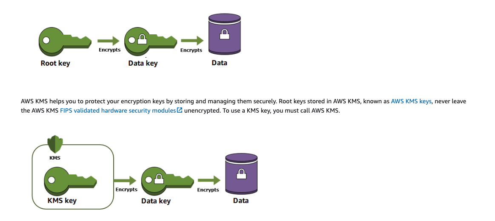

## General Notes

Envelope Encryption is the approach used by Secrets Manager to protect our secrets.

**When you encrypt your data, your data is protected, but you have to protect your encryption key. One strategy is to encrypt it.**

**Envelope encryption is the practice of encrypting plaintext data with a data key, and then encrypting the data key under another key.**

You can even encrypt the data encryption key under another encryption key, and encrypt that encryption key under another encryption key. **But, eventually, one key must remain in plaintext so you can decrypt the keys and your data. This top-level plaintext key encryption key is known as the root key.**

> AWS KMS helps you to protect your encryption keys by storing and managing them securely. Root keys stored in AWS KMS, known as AWS KMS keys, never leave the AWS KMS FIPS validated hardware security modules unencrypted. To use a KMS key, you must call AWS KMS.

### Benefits of Envelope Encryption

#### Protecting data keys

When you encrypt a data key, you don't have to worry about storing the encrypted data key, because the data key is inherently protected by encryption. You can safely store the encrypted data key alongside the encrypted data.

#### Encrypting the same data under multiple keys

Encryption operations can be time consuming, particularly when the data being encrypted are large objects. Instead of re-encrypting raw data multiple times with different keys, you can re-encrypt only the data keys that protect the raw data.

#### Combining the strengths of multiple algorithms

In general, symmetric key algorithms are faster and produce smaller ciphertexts than public key algorithms. But public key algorithms provide inherent separation of roles and easier key management. Envelope encryption lets you combine the strengths of each strategy.

### More Info
