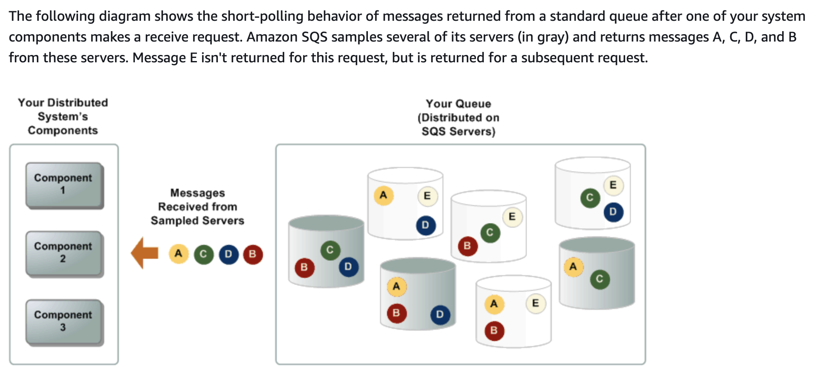

SQS is Distributed Queue Service which provides quick and reliable message exchange solution. Message consumption from SQS is Pull Based and messages can be of maximum 256kb of text in size.

SQS is also used as a trigger for EC2 autoscaling ie Scaleout when number of messages in SQS is more and ScaleIn when number of messages in SQS is low.

### Queue Types
1. Standard
2. FIFO

### Standard Queue:
1. Nearly unlimited Transactions per second
2. No guarantees provided around the order of message delivery
3. Atleast once message delivery semantics but there could be duplicates

### FIFO Queue:
1. Order of message delivery is preserved
2. Guaranteed Once-Only message delivery
3. 300 Transactions per second

### Message Retention:
1. 1 minute to 14 days and default is 4 days

### Visibility Timeout
1. Default is 30 seconds but can be increased up to 12 hours

### Short Polling
With short polling, the ReceiveMessage request queries **only a subset of the servers** (based on a weighted random distribution) to find messages that are available to include in the response. Amazon SQS sends the response right away, even if the query found no messages.

**Short polling occurs when the WaitTimeSeconds parameter of a ReceiveMessage request is set to 0 in one of two ways:**

1. The ReceiveMessage call sets WaitTimeSeconds to 0.
2. The ReceiveMessage call doesn’t set WaitTimeSeconds, but the queue attribute ReceiveMessageWaitTimeSeconds is set to 0.

### Long Polling
When the wait time for the ReceiveMessage API action is greater than 0, long polling is in effect. 

1. Poll and wait for a message to arrive OR wait till the long poll times out. Alleviates the pain of EC2 instances constantly polling SQS queues.
2. Maximum long poll wait time is 20 seconds.

With long polling, the ReceiveMessage request queries **all of the servers for messages**. Amazon SQS sends the response after it collects the maximum number of messages for the response, or when the ReceiveMessage polling wait time expires.

Long polling offers the following benefits:

1. Eliminate empty responses by allowing Amazon SQS to wait until a message is available in a queue before sending a response. Unless the connection times out, the response to the ReceiveMessage request contains at least one of the available messages, up to the maximum number of messages specified in the ReceiveMessage action.

2. Eliminate false empty responses by querying all—rather than a subset of—Amazon SQS servers.
