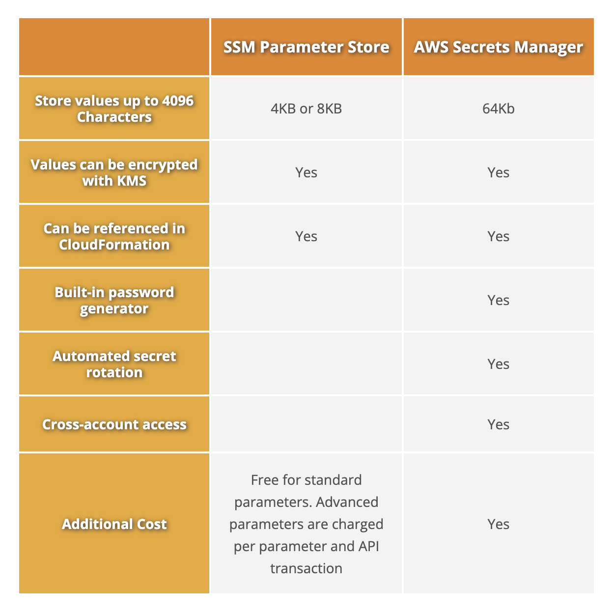

## SSM Paramater Store vs Secrets Manager Features



## Commonalities:
1. Encryption/Decryption for both Services are Integrated with AWS KMS.
```
Apps accessing a Encrypted Parameter or Secret needs to have KMS:Decrypt access on the said Key).
```
2. Both Services have Versioning Feature.
```
Note:ParameterStore only allows one Version to be active at a time where was  
    Secrets Manager allows more than one version to be active at a time).
```

## Secrets Manager:
1. Ability to generate random secrets. 
2. Cross Account Access.
3. Automatic Rotation of Secrets.
4. Well Integrated with Databases ex: RDS, DocumentDB, RedShift etc
5. Can store values up to 4kb.
6. Encrypted by Default

## Parameter Store:
1. Can store values - Standard - up to 4kb and 10,000 Parameters and Advanced - up to 8Kb and More than 10,000 Parameters.
2. Plaintext by Default
3. Free for up to 10,000 Parameters
4. Well Integrated with SSM Automation Functions ex: Run, Session, State etc

