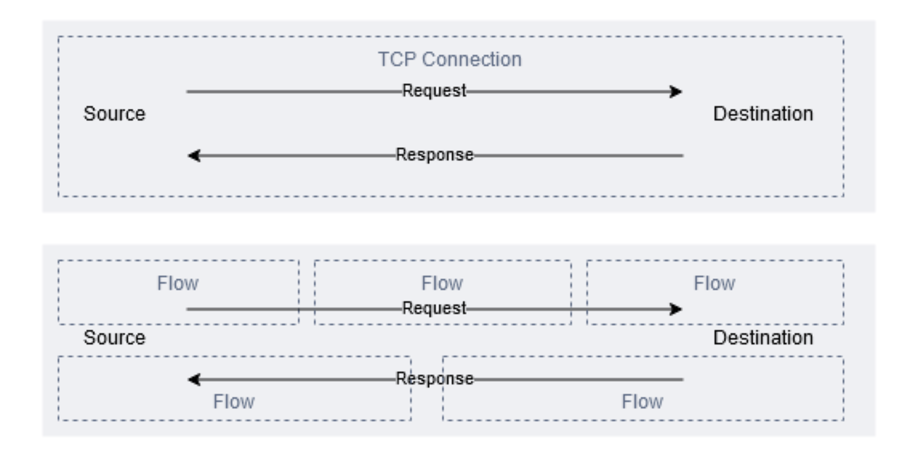

## General Notes

Flow logs can operate at three separate levels within a VPC:

1. VPC - Monitor all the activity with a VPC. Review the pricing before enabling across highly network active VPCs.
2. Subnet - Subnets, a regular use case to target specific subnets like database or DMZ subnets.
3. Network Interface - A single ENI.

## Storage of Flow Logs

Flow logs can be created with two formats and stored in cloudwatch logs or S3.

1. Flow logs --> S3 (Queried via Athena)
2. Flow logs --> CloudWatch Logs --> S3 (Queried via Athena)

## Flow vs Session

1. When working with flow logs, it’s essential to understand the difference between a session and a flow. 
2. A flow is not mapped directly to a session; for example, a TCP session captured in a tool like wireshark would include all packets moving in both directions. 
3. A flow contains only a small section of a session, and only describes packets moving in one direction.

## Sample Testing - Single TCP Message

1. Set-up a server with `netcat` - `server$ nc -l 10000`
2. Send request from a client `client$ echo "hello_flow_logs" | nc IP_ADDRESS 10000`

1. A small single TCP connection created four flows
2. They appear out of order compared to the natural network sequence
3. In this case, are displayed 25 seconds apart

First, let’s review how a single TCP connection creates at least four flows. Recall flow logs collect flows from an ENI perspective across the selected VPC or subnet. The four flows are:

1. A to B outbound from A’s ENI
2. A to B inbound to B’s ENI
3. B to A outbound from B’s ENI
4. B to A inbound to A’s ENI

If we fix the ordering, the expected sequence would be:

How did the flows end up 25 seconds apart and out of order?

The 25 second gap requires looking more into timestamps and how flow logs are generated.

Flow logs have a capture window of up to 10 minutes, followed by processing and publishing. The total time of capture+processing+publishing is the aggregation period, which is up to 15 minutes. The capture windows and aggregation periods are per ENI and not synced at a VPC level. This is how the flows for the server ENI ended up recorded 25 seconds after the client flows.

The two timestamp fields, start and end within the flowlog can also be misunderstood. In the example above, they are recorded as:

These are the start and end of the capture window. They have the same values on both flows on each ENI as they were captured inside the same capture window.

## Sample Testing - IP Load Test